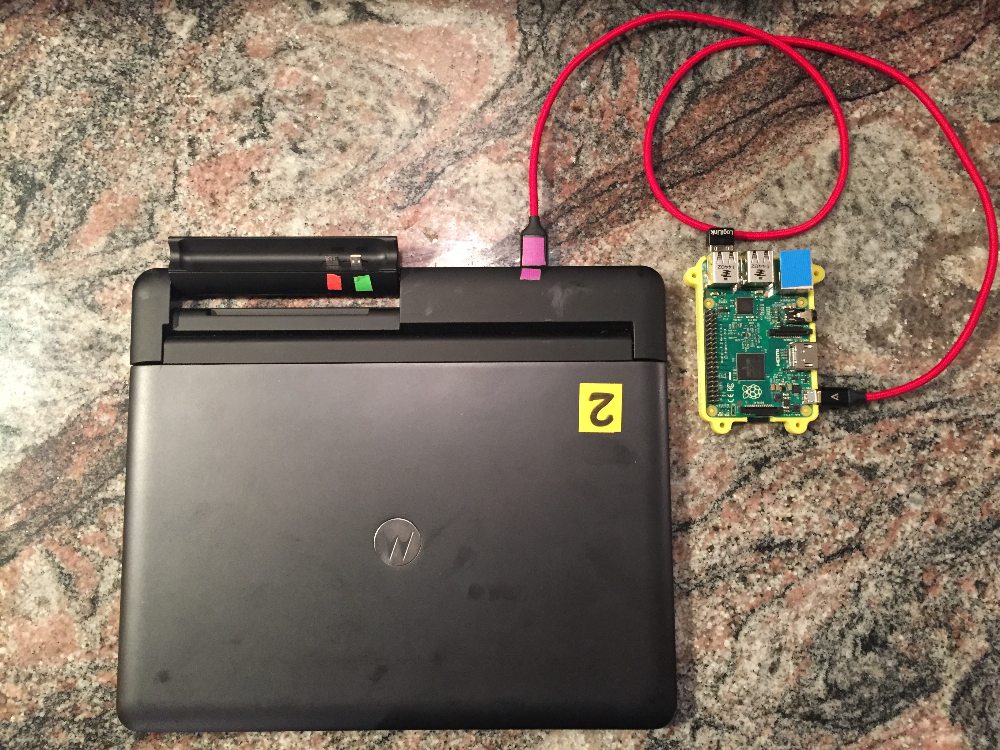
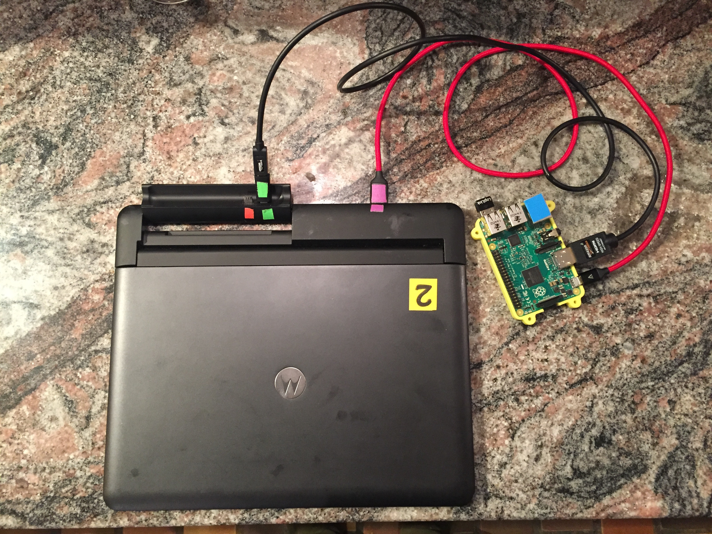
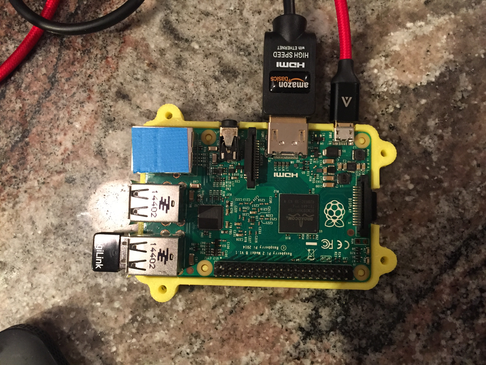
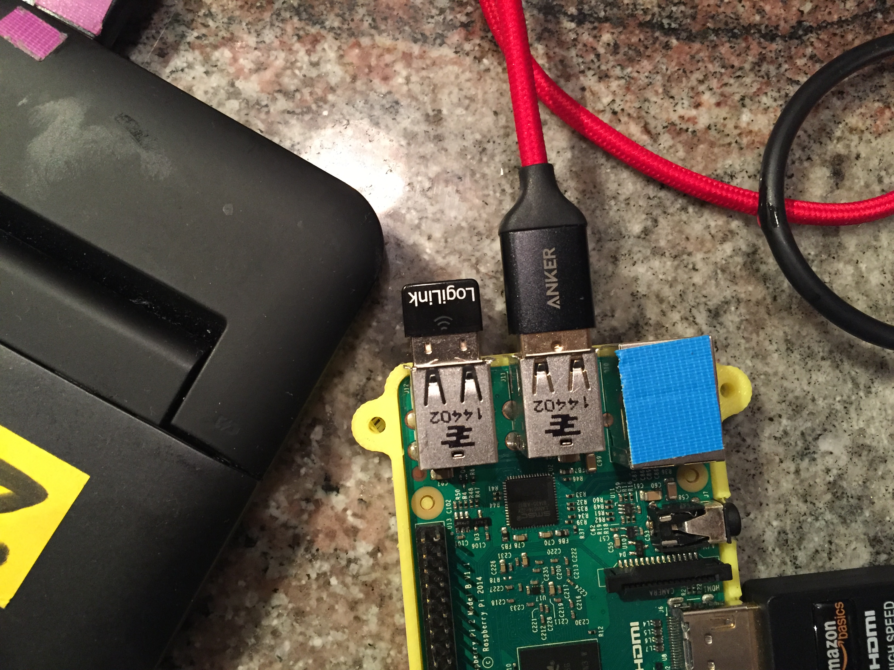
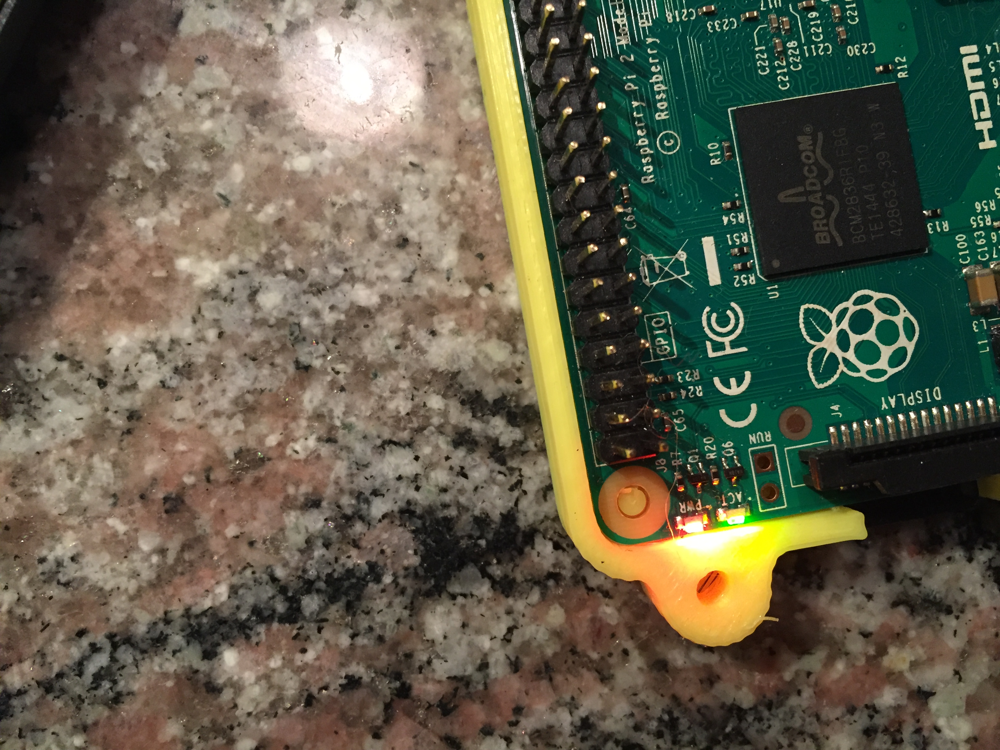
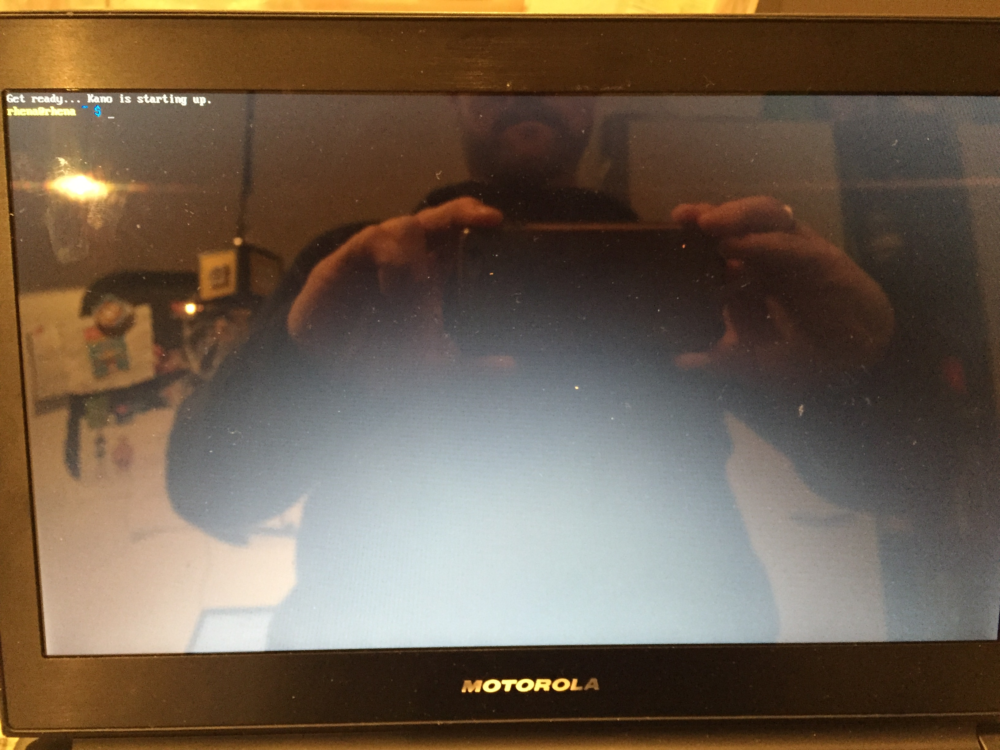

# Minecraft-Hacking-Raspberry-Pi-Grundlagen

---

##Kursinhalt
###SD Karte brennen
* [Download] (http://www2.kano.me/downloads) kano image 
* Mac -> [ApplePiBaker] (http://www.tweaking4all.com/hardware/raspberry-pi/macosx-apple-pi-baker/I), Anleitung [hier](./imagebrennenmac.md) 
* Windows -> [Win32 Disk Imager] (http://sourceforge.net/projects/win32diskimager/)
* Linux -> im Terminal folgendes eingeben:  `sudo dd if=sdcard.img of=/dev/sdb`

###Lapdock mit dem Pi verbinden
1. Schaue dir meine Einkaufsliste an und kaufe was du brauchst
2. Nehme eins der beiden Mirco USB zu USB Kabel und stecke das Mirco USB in den Pi und das USB in den zugeklappten Lapdock

3. Verbinde das HDMI Kabel mit dem HDMI Adapter und stecke das eine Ende in den rechten Port des Lapdock und das andere Ende in den HDMI Port des Pis

4. Verbinde das zweite Mirco USB Kabel mit dem USB Adapter und Stecke es in den Linken Port des Lapdocks

5. Check ob die Kabel fest drin stecken und klappe dann den Lapdock auf. Das rote LED am Pi sollte angeben und das grüne blinken, außerdem sollte etwas am Bildschirm zu sehen sein.

6. Solltest du nichts auf dem Bildschirm sehen überprüfe folgendes:
	* sind alle Kabel richtig angeschlossen, überprüfe jedes Kabel einzelnd
	* stecken die Kabel fest im Pi und im Lapdock
	* Hat mein Lapdock genügend Power, drücke den kleinen Knopf unter dem Trackpad, um zu sehen wieviel Power der Akku noch hat und schließe den Lapdock an den Strom an
	* Klappe den Lapdock zu und wieder auf
manchmal kann es sein dass du ein schlechtes USB Kabel hast, wenn es nicht klappt verwenden ein anderes USB Kabel  

7. Solltest du eine Fehlermeldung auf dem Bildschirm sehen oder sollte der Pi immer wieder booten, kann die SD Karte kaputt sein. Brenne eine zweite SD Karte und probiere es mit ihr aus.

##FAQ
**Wie schließe ich meinen Lapdock an?**

Siehe oben

**Wie wird der Pi mit Strom versorgt?**

Der Pi wird über das USB Kabel im Lapdock mit Strom versorgt. Bei meinem Setup ist es das Kabel mit dem Lila Tape drauf. 

**Was ist das Password beim einloggen in Kano**

kano 

**Die Zeichen auf den Tasten stimmen nicht mit meinem Keyboard Layout überein, was kann ich machen?**

Unter Settings in kano kannst du deine Tastaturbelegungen ändern. 

Und mit einem [Tastatursticker ](http://www.amazon.de/Selbstkleben-Deutsche-Tastatur-Aufkleber-TastaturAufkleber/dp/B0050O4K5C/ref=pd_sim_sbs_201_4?ie=UTF8&dpID=31ijYeQClxL&dpSrc=sims&preST=_AC_UL160_SR160%2C160_&refRID=1J1A4ZD3M4SX3HV9JPDT)kannst du dir eine Deutsche Tastatur auf die Tasten kleben.

### Linux Terminal

*coming soon

###Sonic Pi

* coming soon

###GPIOS 

####Scratch

* coming soon

####Python und Minecraft

* coming soon

##Einkaufsliste
Einkaufsliste (Affiliate Links): hier alles als [Amazon Wunschliste] (http://www.amazon.de/registry/wishlist/17R4WSRLOP3DI)

**1. Bildschirm** (59€ + 6,90€ = 65,9 €)
 --> [Lapdock] (http://www.amazon.de/gp/product/B00519L43M/ref=as_li_tl? ie=UTF8&camp=1638&creative=19454&creativeASIN=B00519L43M&linkCode=as2&tag=andrkopp-21)
 
**2. Computer** (38 €)
--> [Raspberry Pi 2](http://www.amazon.de/gp/product/B00T2U7R7I/ref=as_li_tl? ie=UTF8&camp=1638&creative=19454&creativeASIN=B00T2U7R7I&linkCode=as2&tag=andrkopp-21)

**3. Kabel um den Lapdock anzuschließen** (Total: 28,98 €)

* [Micro HDMI female zu Micro HDMI female Adapter](http://www.amazon.de/gp/product/B00F9X8HJO/ref=as_li_tl? ie=UTF8&camp=1638&creative=19454&creativeASIN=B00F9X8HJO&linkCode=as2&tag=andrkopp-21) (das kommt in den rechten Connector des Lapdocks)  (5,66 €)
* [HDMI zu Micro HMDI Kabel]  (http://www.amazon.de/gp/product/B0096LZ5QI/ref=as_li_tl? ie=UTF8&camp=1638&creative=19454&creativeASIN=B0096LZ5QI&linkCode=as2&tag=andrkopp-21) (eine Seite in den Micro HDMI Adapter die andere in den Pi) (7,49 €) 
* [USB female zu USB female]
(http://www.amazon.de/gp/product/B0018Z7VDA/ref=as_li_tl? ie=UTF8&camp=1638&creative=19454&creativeASIN=B0018Z7VDA&linkCode=as2&tag=andrkopp-21) (diesen Adapter stecken wir in den Linken Port) (2,85 €)
* [2 X USB zu Micro USB Kabel]  (http://www.amazon.de/gp/product/B00SWSM6MM/ref=as_li_tl? ie=UTF8&camp=1638&creative=19454&creativeASIN=B00SWSM6MM&linkCode=as2&tag=andrkopp-21)  (das kommt einmal in den Lapdock und die andere Seite in den Raspi Power Port, das andere in den Adapter den wir in den linken Port des Kapdocks gesteckt haben.)(6,49 €)

**4. Accessory** (Total: 18,51 €)

* [WLAN Stick](http://www.amazon.de/gp/product/B007JWB1N2/ref=as_li_tl? ie=UTF8&camp=1638&creative=19454&creativeASIN=B007JWB1N2&linkCode=as2&tag=andrkopp-21) (7,03€)  
* [Maus](http://www.amazon.de/gp/product/B00YMINV8Y/ref=as_li_tl? ie=UTF8&camp=1638&creative=19454&creativeASIN=B00YMINV8Y&linkCode=as2&tag=andrkopp-21) (5,99 €)
* [Extra SD Karte](http://www.amazon.de/gp/product/B008RDCCFS/ref=as_li_tl? ie=UTF8&camp=1638&creative=19454&creativeASIN=B008RDCCFS&linkCode=as2&tag=andrkopp-21) (5,49€)
* USB Stick für Backup - gebraucht von zu Hause

GRAND TOTAL ohne Accessory: **132,88 €**      
GRAND TOTAL mit Accessory : **154,43 €**

##LINKS 
* [Ressources in Englisch auf der Raspberry Pi Webseite] (https://www.raspberrypi.org/resources/)
* [Deutsches Raspberry Pi Forum] (http://www.forum-raspberrypi.de/)
* Google it!

## Download

* Entweder über "Download ZIP" rechts oben
* Oder direkt über git, ein gutes Tutorial dazu findest du hier: [try.github.io](https://try.github.io)

##Lizenz
Dieses Repository ist unter der Creative Commons Lizenz [CC-BY-SA] (http://creativecommons.org/licenses/by-sa/4.0/) lizensiert. 

## Kontakt

Schreibe uns jeder Zeit eine e-mail wenn du Fragen hast die in diesem Repository nicht benantwortet wuden. 

* Web: [www.erfindergarden.de](http://www.erfindergarden.de)
* Email: [play@erfindergarden.de](mailto:play@erfindergarden.de)
* Twitter: [@andreaskopp](https://twitter.com/andreaskopp) und [@jsphpl](https://twitter.com/jsphpl)